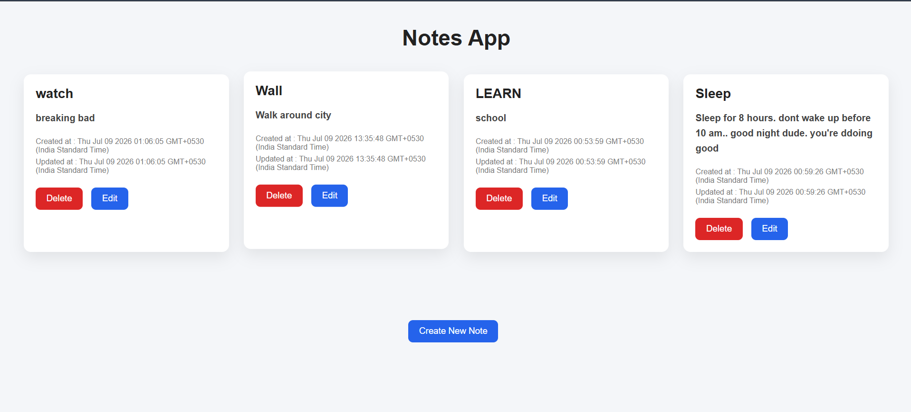
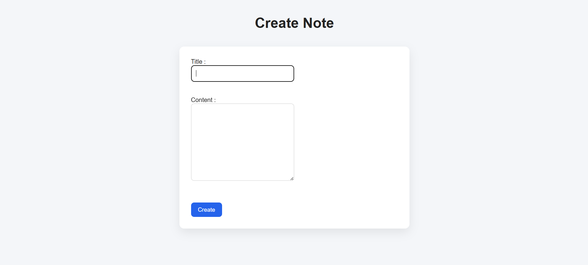
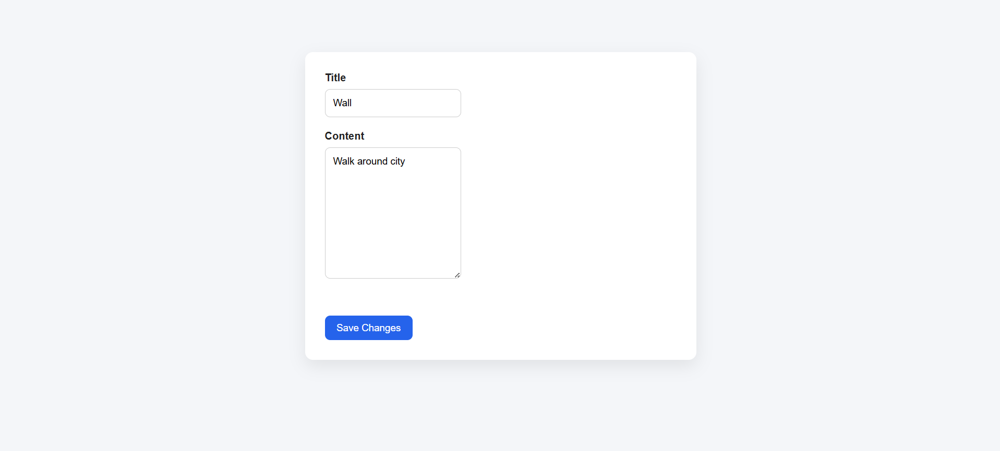

# Notes CRUD App

A simple Notes CRUD application built using Node.js, Express.js, MySQL, and EJS.

## Features

- Create Notes
- View Notes
- Edit Notes
- Delete Notes
- MySQL Database Integration
- Method Override for PATCH and DELETE requests

# Screenshots

## Home Page



## Create Note



## Edit Note



## Tech Stack

- Node.js
- Express.js
- MySQL
- EJS
- HTML
- CSS

## Installation

```bash
git clone https://github.com/shahid-af4161/Notes-CRUD.git
cd Notes-CRUD
npm install
```

Create a `.env` file:

```env
DB_HOST=localhost
DB_USER=your_username
DB_PASSWORD=your_password
DB_NAME=Notes
PORT=3000
```

Run the project:

```bash
node index.js
```

Open:

```
http://localhost:3000/notes
```

## Database

Run the `Schema.sql` file before starting the application.
